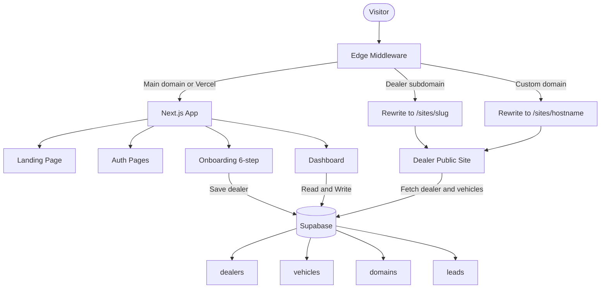
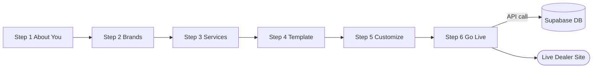
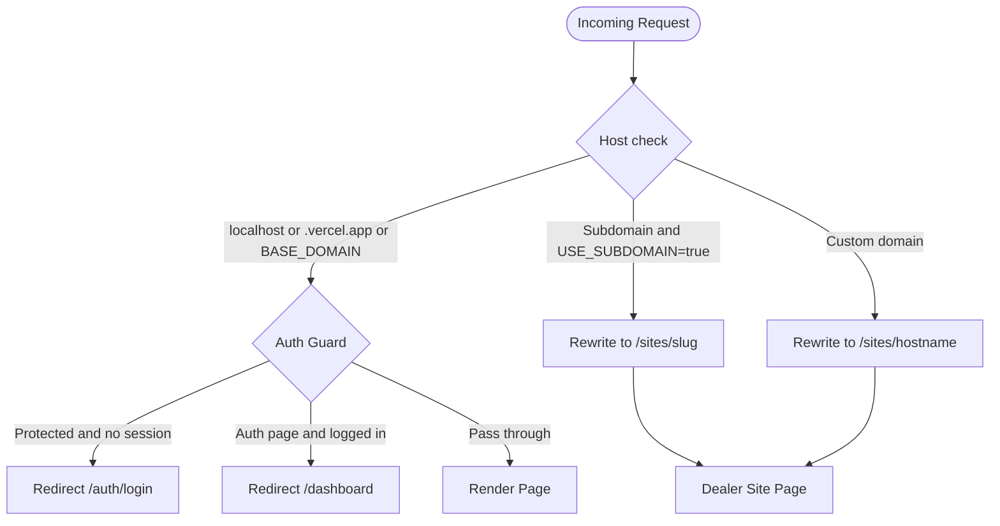
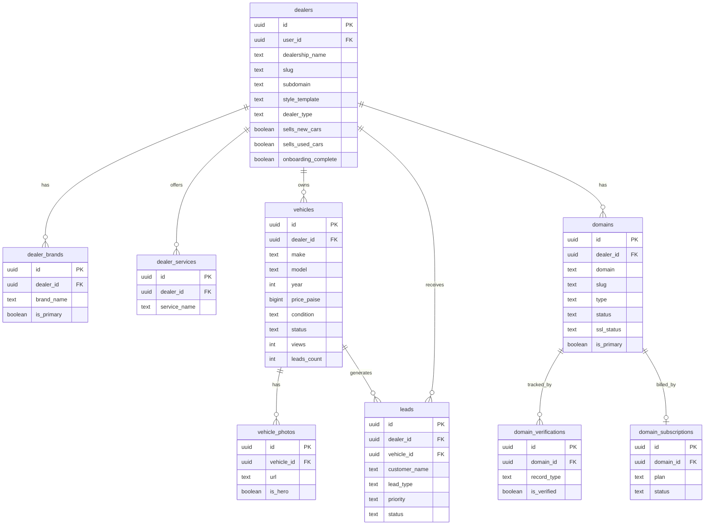
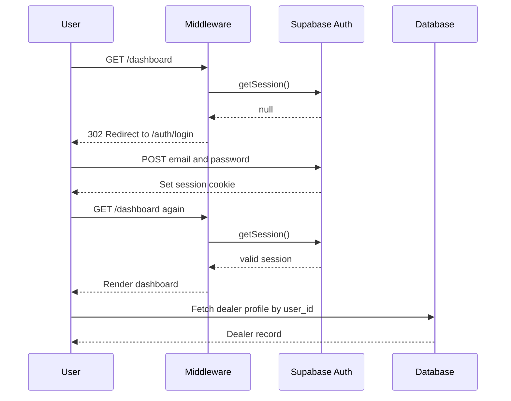

# DealerSite Pro

> Zero-code dealership website builder for Indian automotive dealers — go live in minutes.

DealerSite Pro lets any car dealer create a professional, SEO-ready website through a guided 6-step onboarding flow. No technical skills required. Supports single-brand OEM dealers, multi-brand dealers, used-car lots, and hybrid operations.

---

## Table of Contents

- [Overview](#overview)
- [Tech Stack](#tech-stack)
- [Architecture](#architecture)
- [Onboarding Flow](#onboarding-flow)
- [URL Routing](#url-routing)
- [Database Schema](#database-schema)
- [Authentication Flow](#authentication-flow)
- [Template System](#template-system)
- [Project Structure](#project-structure)
- [Environment Variables](#environment-variables)
- [Getting Started](#getting-started)
- [API Reference](#api-reference)
- [Deployment](#deployment)

---

## Overview

| Feature | Description |
|---------|-------------|
| **Website Templates** | 4 themes: Luxury, Modern, Sporty, Family |
| **Inventory Management** | Add, filter, and showcase vehicles |
| **Lead CRM** | Track inquiries, test drives, follow-ups |
| **Analytics** | Visitor trends, conversion funnel |
| **Domain System** | Free subdomain → custom domain → managed domain |
| **Multi-brand Support** | Separate websites per OEM brand |
| **Dark / Light Mode** | System-aware theme toggle |

---

## Tech Stack

| Layer | Technology |
|-------|-----------|
| Framework | Next.js 15 (App Router) |
| Language | TypeScript 5 |
| Styling | Tailwind CSS + tailwind-animate |
| UI Components | Radix UI + shadcn/ui |
| Auth + DB | Supabase (PostgreSQL + Auth + Storage) |
| State | Zustand (with localStorage persistence) |
| Icons | Lucide React |
| Payments | Razorpay (subscriptions) |
| Email | Resend |
| DNS | Cloudflare API + GoDaddy API |

---

## Architecture



---

## Onboarding Flow

Dealers complete 6 steps to publish their website. Data persists in Zustand + localStorage across page reloads.



**Dealer Types** auto-detected from step 2 choices:

| Type | Condition |
|------|-----------|
| `single_oem` | New cars only, 1 brand |
| `multi_oem` | New cars only, multiple brands |
| `used_only` | Used cars only |
| `hybrid` | Both new and used |

---

## URL Routing

The [`middleware.ts`](middleware.ts) file handles all multi-tenant routing at the Edge.



**Domain modes** controlled by env vars:

| `NEXT_PUBLIC_USE_SUBDOMAIN` | URL pattern | Use case |
|---|---|---|
| `false` (default) | `your-app.vercel.app/sites/abc-motors` | Vercel free tier |
| `true` | `abc-motors.dealersitepro.com` | Custom domain with wildcard DNS |

---

## Database Schema



---

## Authentication Flow



---

## Template System

```mermaid
flowchart LR
    SLUG[/sites/abc-motors] --> PAGE[sites/slug/page.tsx]
    PAGE -->|fetch dealer| DB[(Supabase)]
    DB -->|style_template value| SEL{Select Template}

    SEL -->|luxury| LUX[LuxuryTemplate]
    SEL -->|family| FAM[FamilyTemplate]
    SEL -->|sporty| SPT[SportyTemplate]
    SEL -->|professional| MOD[ModernTemplate]

    LUX --> OUT[Rendered Site]
    FAM --> OUT
    SPT --> OUT
    MOD --> OUT

    OUT --> HERO[Hero Section]
    OUT --> GRID[Car Grid and Filters]
    OUT --> LEAD[Lead Capture Modal]
```

| Template | Best For |
|----------|---------|
| **Luxury** | Premium brands: BMW, Mercedes, Audi |
| **Modern** | Professional multi-brand dealerships |
| **Sporty** | Performance cars and SUVs |
| **Family** | Mass-market: Maruti, Hyundai, Tata |

---

## Project Structure

```
dealer-site-pro/
├── app/
│   ├── auth/               # Login and register
│   ├── onboarding/
│   │   ├── step-1/         # About You
│   │   ├── step-2/         # Brands
│   │   ├── step-3/         # Services
│   │   ├── step-4/         # Template
│   │   ├── step-5/         # Customize
│   │   └── step-6/         # Go Live
│   ├── dashboard/
│   │   ├── page.tsx        # Overview
│   │   ├── inventory/      # Vehicle management
│   │   ├── leads/          # CRM
│   │   ├── analytics/      # Traffic and conversions
│   │   ├── reviews/        # Customer reviews
│   │   ├── messages/       # Inquiries
│   │   ├── domains/        # Domain setup
│   │   └── settings/       # Account settings
│   ├── sites/[slug]/       # Public dealer websites
│   ├── preview/            # Template preview tool
│   └── api/
│       ├── cars/           # Car catalog endpoints
│       ├── domains/        # Domain CRUD and DNS
│       ├── domain/         # Verification workflow
│       ├── payments/       # Razorpay subscriptions
│       └── cron/           # Background monitoring
│
├── components/
│   ├── ui/                 # Base components (shadcn/ui)
│   ├── templates/          # 4 website templates
│   ├── cars/               # Car grid, cards, modals
│   ├── domain-onboarding/  # Domain setup wizard
│   └── WebsiteLiveBanner.tsx
│
├── lib/
│   ├── db/                 # Supabase query functions
│   ├── services/           # Domain, DNS, payment logic
│   ├── store/              # Zustand onboarding store
│   ├── utils/              # slug.ts, domain.ts, etc.
│   └── types/              # TypeScript interfaces
│
├── middleware.ts            # Edge routing (multi-tenant)
├── next.config.ts           # Next.js config
├── tailwind.config.ts       # Design tokens
├── supabase/migrations/     # DB schema files
└── docs/                    # Technical documentation
```

---

## Environment Variables

Edit the `.env` file with your values:

```env
# App domain
NEXT_PUBLIC_BASE_DOMAIN=localhost:3000
NEXT_PUBLIC_USE_SUBDOMAIN=false

# Supabase
NEXT_PUBLIC_SUPABASE_URL=https://your-project.supabase.co
NEXT_PUBLIC_SUPABASE_ANON_KEY=your-anon-key

# GoDaddy
GODADDY_API_KEY=your_key
GODADDY_API_SECRET=your_secret
GODADDY_API_URL=https://api.godaddy.com

# Razorpay
NEXT_PUBLIC_RAZORPAY_KEY_ID=rzp_test_xxx
RAZORPAY_KEY_SECRET=your_secret

# Cloudflare
CLOUDFLARE_API_TOKEN=your_token
CLOUDFLARE_ZONE_ID=your_zone_id

# Resend (email)
RESEND_API_KEY=re_xxx

# Cron security
CRON_SECRET=your_random_secret
```

---

## Getting Started

### Prerequisites

- Node.js 18+
- A Supabase project (free tier works)

### 1. Install dependencies

```bash
npm install
```

### 2. Configure environment

Edit `.env` with your Supabase credentials.

### 3. Apply database migrations

In the Supabase SQL editor, run in order:

```
supabase/migrations/20240217_create_cars_table.sql
supabase/migrations/20260217_complete_schema.sql
```

### 4. Run the development server

```bash
npm run dev
```

Open [http://localhost:3000](http://localhost:3000).

### 5. Create your first dealer account

1. Register at `/auth/register`
2. Complete all 6 onboarding steps
3. Your site goes live at `localhost:3000/sites/your-slug`

---

## API Reference

### Cars

| Method | Endpoint | Description |
|--------|----------|-------------|
| GET | `/api/cars` | List cars with filters |
| GET | `/api/cars/featured` | Featured cars |
| GET | `/api/cars/[id]` | Single car detail |

### Domains

| Method | Endpoint | Description |
|--------|----------|-------------|
| GET | `/api/domains` | List dealer domains |
| POST | `/api/domains/create-subdomain` | Generate free subdomain |
| GET | `/api/domains/check-slug` | Check slug availability |
| POST | `/api/domains/connect-custom` | Connect custom domain |
| POST | `/api/domains/verify-dns` | Verify DNS records |
| POST | `/api/domains/purchase-managed` | Buy managed domain |

### Domain Verification

| Method | Endpoint | Description |
|--------|----------|-------------|
| POST | `/api/domain/start-onboarding` | Begin verification flow |
| GET | `/api/domain/verification-status/[id]` | Poll verification status |
| GET | `/api/domain/propagation-status/[id]` | Check DNS propagation |
| GET | `/api/domain/dns-scan/[id]` | Scan live DNS records |

### Payments

| Method | Endpoint | Description |
|--------|----------|-------------|
| POST | `/api/payments/create-subscription` | Create Razorpay subscription |
| POST | `/api/payments/verify` | Verify payment signature |

---

## Deployment

### Vercel (Recommended)

1. Push to GitHub
2. Import at [vercel.com/new](https://vercel.com/new)
3. Add all environment variables in Vercel dashboard
4. Set `NEXT_PUBLIC_BASE_DOMAIN` to your Vercel URL (e.g. `dealer-site-pro.vercel.app`)
5. Keep `NEXT_PUBLIC_USE_SUBDOMAIN=false` on the free tier
6. Deploy

### Custom Domain with Subdomain Routing

1. Set `NEXT_PUBLIC_BASE_DOMAIN=dealersitepro.com`
2. Set `NEXT_PUBLIC_USE_SUBDOMAIN=true`
3. Add a wildcard DNS record: `*.dealersitepro.com → your-vercel-cname`
4. Add `*.dealersitepro.com` as a custom domain in Vercel

---

## Domain Tiers

| Tier | Price | Description |
|------|-------|-------------|
| **Free** | Rs 0 / forever | yoursite.dealersitepro.com subdomain |
| **Pro** | Rs 499 / month | Connect your own domain (GoDaddy, Namecheap) |
| **Premium** | Rs 999 / month | We buy and manage a domain for you |

---

## Roadmap

- [ ] WhatsApp Business integration for lead notifications
- [ ] AI-powered lead scoring
- [ ] Mobile app for dealer management
- [ ] Multi-language support (Hindi, Tamil, Telugu)
- [ ] Marketplace for premium themes and plugins

---

## License

Private — All rights reserved. 2026 DealerSite Pro.
